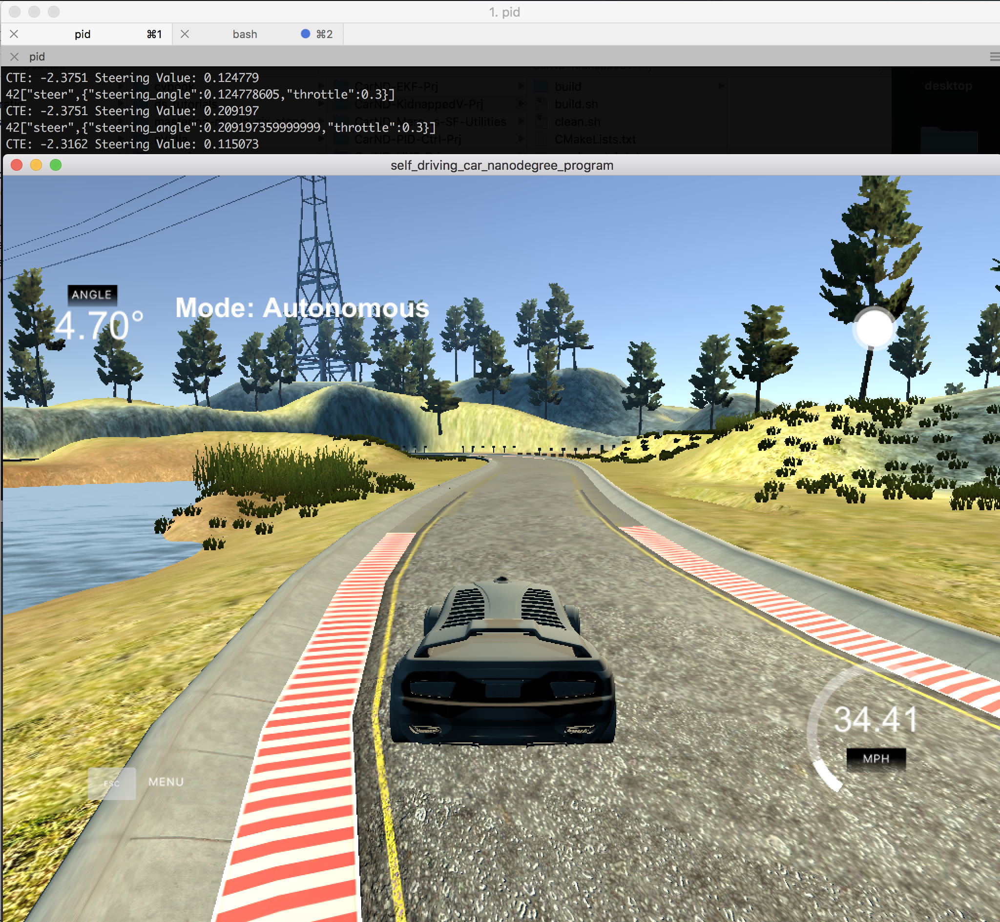

# Term2 - Project 4 : PID control project

Self-Driving Car Engineer Nanodegree Program

Project 4 - PID control project

# Project Rubric

### Compiling

After cloning this repo.

```
1. mkdir build
2. cd build
3. cmake ..
4. make
5. ./pid
```

### Parameter setting

Empirically determined Kp, Kd, Ki parameters upon multiple test with simulator.

```
pid.Init(0.1,0.00005,1.5);
```

### Simulation result

It drived simulation track smoothly around 35 MPH speed.


